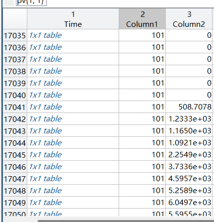

The dataset is explained as follows: the uploaded data is a dataset of power generation output from distributed PV systems on the roofs of buildings in a city in southern China, totaling 170 users, of which 31 have a state of abnormally decreasing fault power. The grid connection time is concentrated in April 2020, and the generation record starts from 5.1 and ends in December 2022. For compressed data, the data is saved in mat format, the first column of the data is the sampling time, the second column is the installed capacity (kW), and the third column is the generation power.

After using matlab to open the .mat file, there are 170 tables with 53278 data in each table, which is guessed to be the generation power recorded at intervals between 2022.5.1 and 2022.12.

It does not provide data on what is an abnormal drop in power, and only the power generated is provided, which may not give significant results.

数据集解释为：上传数据为中国南方某市建筑屋顶分布式光伏系统发电出力数据集，共计170用户，其中31户存在故障功率异常下降的状态。并网时间集中在2020年4月份，发电记录从5.1开始，截止2022年12月。为压缩数据，数据保存格式为mat，数据第一列为采样时间，第二列为装机容量（kW），第三列为发电功率。

经过使用matlab打开其.mat文件，其中共有170个表，每个表中有53278个数据，猜测为2022.5.1至2022.12中间每隔一段时间记录的发电功率。

其中并未提供哪些为功率异常下降的数据，也仅提供了发电功率，可能并不能得到显著结果。

